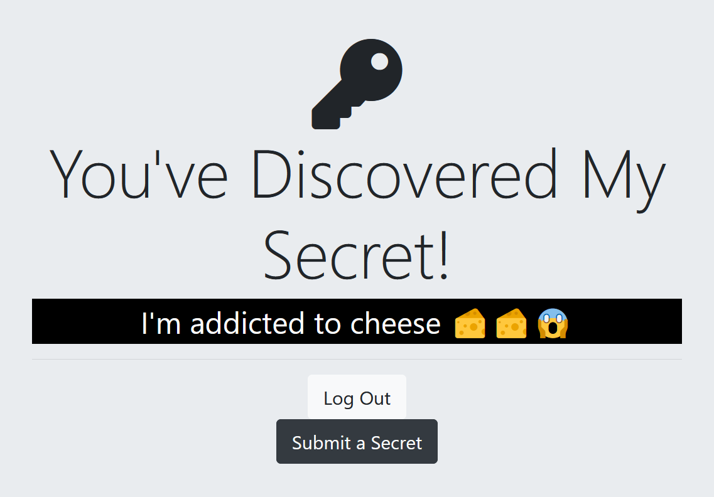

# Auth practice with Google OAuth v2

 

*   Secrets submitting app as practice for different levels of security and password encryption.
*   Google Credentials sign-up enabled.


<h2>🛠️ Installation Steps:</h2>

<p>1. Clone repository and run this command on the project's root directory in order to install dependencies </p>

```
npm install
```

<p>2. To start the server, run the following command: </p>

```
npm start
```
<p>By default server will run on `http://localhost:3000`</p>

<p>3. Google OAuth API 2.0 credentials are not uploaded to the remote repository due to security. Can be provided if needed for an .env file.</p>

```
GOOGLE_CLIENT_ID=<client_id>
GOOGLE_CLIENT_SECRET=<client_secret>
```
  
<h2>💻 Built with</h2>

Technologies used in the project:

*   Node.js
*   EJS
*   MongoDB